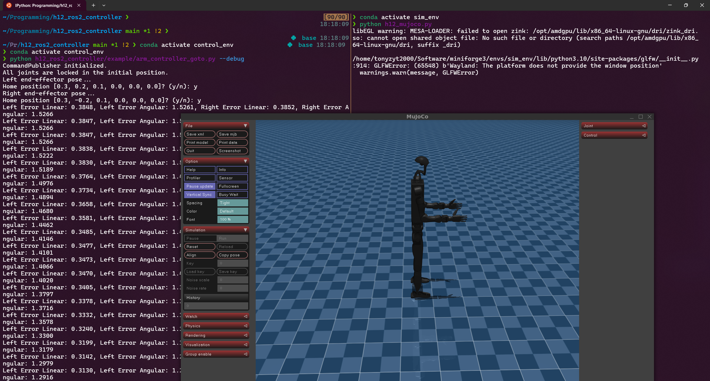

# h12_ros2_controller

Controller of the h12 robot with ROS2 services.

## Installation

- This repo depends on [Unitree Python SDK](https://github.com/unitreerobotics/unitree_sdk2_python) to communicate with the robot.
- Download Unitree SDK under `submodules/unitree_sdk2_python` by initializing git submodules:

  ```bash
  git submodule update --init --recursive
  ```

### `uv` Installation

- Easiest way to run scripts in this repo is to use [`uv`](https://docs.astral.sh/uv/getting-started/installation/)
- Commands:

    ```bash
    uv sync # install dependencies for this repo including unitree sdk
    uv run PATH_TO_SCRIPT
    ```

### `pip` Installation

- `requirements.txt` lists dependencies that can be installed by `pip`.
- Commands:

    ```bash
    pip install -r requirements.txt # install dependencies for this repo including unitree sdk
    ```

## Documentation

This repository includes a full documentation site under `docs/` with:

- Searchable guides and operations docs
- Architecture and end-to-end flow diagrams
- API reference generated from source modules

Build and serve docs locally:

```bash
pip install -r docs/requirements.txt
python -m mkdocs serve
```

Build static docs site:

```bash
python -m mkdocs build
```

If your shell resolves to a system `mkdocs` binary with dependency conflicts, use:

```bash
uv run --with-requirements docs/requirements.txt python -m mkdocs build
```

## ROS Setup

- Create an empty ros worksapce and place this repo under `src`.
- This package depends on two additonal ROS2 packages that holds messages and robot description.
    - [h12_ros2_model](https://github.com/correlllab/h12_ros2_model)
    - [custom_ros_messages](https://github.com/correlllab/custom_ros_messages)
- Run `colcon build` and then `source ./install/setup.bash` to build the project.

## Files

- `assets/` contains robot description files. Only used when running the programs without ros environment.
- `config/` contains configurations for the controller.
- `data/` contains saved data such as joint positions.
- `figures` contains generated figures.
- `h12_ros2_controller/`: contains source code.
    - `core/`: contains the core implementaiton of robot kinematics solver, controller and communication interface.
        - `controller/` contains different controllers.
            - `hand_controller.py` tracks hand states and commands finger positions.
            - `upper_controller.py` is the base class for upper body controllers (ArmController, FrameController, ImpedanceController, GravityCompController).
            - `arm_controller.py` provides functions to control end-effectors and query their states.
            - `frame_controller.py` provides functions to add frame tasks for any frame and move the upper body accordingly.
            - `gravity_comp_controller.py` provides functions to fix upper body in any fixed pose using I-control.
            - `impedance_controller.py` provides functions to control end-effectors with impedance.
        - `channel_interface.py` implements a publisher for motor commands and a subscriber for motor states using the Unitree Python SDK.
        - `ik_solver` solves inverse kinematics with self-collision avoidance.
        - `low_cmd_handler` sends command through `low_cmd_publisher` and monitors robot states from `robot_model` to trigger active e-stop.
        - `robot_model.py` tracks robot states and provides useful functions for kinematics, Jacobians, etc., using Pinocchio.
    - `plot/` contains scripts to plot figures.
    - `example/` contains example scripts using core functionalities without ros dependencies.
    - `utility/` contains useful scripts to inspect robot descriptions, process collision pairs, and inspect joint velocities.
    - Python files in the root folder are ros nodes.

## Usage

### `arm_controller_goto.py`

- Run arm controller that prompt for target end-effector positions in command line.

    ```bash
    # choose config file depending on usage
    uv run h12_ros2_controller/arm_controller_goto.py --config debug.yaml # default
    uv run h12_ros2_controller/arm_controller_goto.py --config sport.yaml # sport mode
    uv run h12_ros2_controller/arm_controller_goto.py --config safety_full.yaml # safety layer full-body mode
    uv run h12_ros2_controller/arm_controller_goto.py --config safety_split.yaml # safety layer split mode
    ```

- Change `visualize=True` when initializing the controller to have the meshcat visualization

    ```python
    arm_controller = ArmController('assets/h1_2/h1_2.urdf',
                                   'assets/h1_2/h1_2_sphere.urdf',
                                   'assets/h1_2/h1_2_sphere_collision.srdf',
                                   dt=0.02,
                                   visualize=True, # use this to turn on meshcat visualization
                                   sport_mode=False)
    ```

- Change `arm_controller.control_step_reduced()` to `arm_controller.sim_step_reduced()`
    to directly integrate the control input to the pinocchio model.
    This is useful when checking IK results without running the full dynamics in simulation
    or on real robot.

- Example usage with mujoco sim:
    - Launch [mujoco simulation](https://github.com/HIRO-group/h1_mujoco) using `python h12_mujoco.py`.
    - Launch arm controller in debug mode using `python h12_ros2_controller/arm_controller_goto.py --debug`.

    

## ROS Interface

### Dual Arm Server & Client

- Launch the server first

    ```bash
    ros2 run h12_ros2_controller dual_arm_server --config debug.yaml # default
    # other available configs: sport.yaml, safety_full.yaml, safety_split.yaml
    ```

- Then launch the client and enter either a named config goal targets for both wrists.

    ```bash
    ros2 run h12_ros2_controller dual_arm_client
    ```

- The client can send named configs from `utility/named_config.py` or interactively enter frame names and target poses
- Press BACKSPACE to cancel the active goal

### Frame Task Server & Client

- Launch the server first

    ```bash
    ros2 run h12_ros2_controller frame_task_server --config debug.yaml # default
    # other available configs: sport.yaml, safety_full.yaml, safety_split.yaml
    ```

- Then launch the client and enter either a named config or manual frame targets.

    ```bash
    ros2 run h12_ros2_controller frame_task_client
    ```

- The client can send named configs from `utility/named_config.py` or interactively enter frame names and target poses
- Press BACKSPACE to cancel the active goal

### Launch Files

- [desktop_launch.py](launch/desktop_launch.py) starts `rviz2` with the default RViz config after a short delay
- [full_launch.py](launch/full_launch.py) starts `robot_state_publisher`, `joint_state_publisher`, `dual_arm_server`, and `rviz2`
- [robot_launch.py](launch/robot_launch.py) starts `robot_state_publisher`, `joint_state_publisher`, `frame_task_server`, and `hand_controller_node`
- [robot_safety_launch.py](launch/robot_safety_launch.py) starts `robot_state_publisher`, `joint_state_publisher`, `frame_task_server`, `h12_safety_layer/safety_node`, and `hand_controller_node`
- [robot_tf_launch.py](launch/robot_tf_launch.py) starts `robot_state_publisher` and `joint_state_publisher` with a higher TF publish frequency

- Use `ros2 launch h12_ros2_controller <launch_file>` to run any of these launch descriptions
- `robot_launch.py` and `full_launch.py` accept `config:=...` for the controller server node, for example:

    ```bash
    ros2 launch h12_ros2_controller robot_launch.py config:=debug
    ros2 launch h12_ros2_controller robot_launch.py config:=debug.yaml
    ros2 launch h12_ros2_controller full_launch.py config:=config/safety_full
    ```

- `robot_safety_launch.py` accepts both `config:=...` and `safety_config:=...` with matching `_full` or `_split` suffixes:

    ```bash
    ros2 launch h12_ros2_controller robot_safety_launch.py config:=safety_full safety_config:=default_safety_full
    ros2 launch h12_ros2_controller robot_safety_launch.py config:=safety_split safety_config:=default_safety_split
    ```
