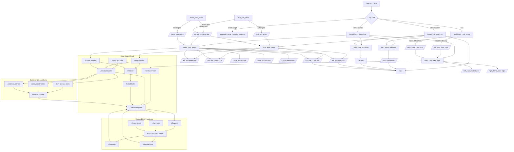

# End-to-End Flow Diagram

A full topic/service/action and runtime flow from user command to robot actuation.

## Operational interpretation

- ROS2 clients are command front-ends; control authority is in the server/controller stack.
- **Recommended:** Use `frame_task_server` for general manipulation; `dual_arm_server` is legacy.
- `frame_task_server` publishes EE pose/target topics for monitoring and rviz visualization, whether or not frame_task goals are active.
- Safety checks are continuous and independent of action success.
- RViz receives state/target streams for observability; it does not command hardware.
- Direct scripts bypass ROS2 actions but still pass through the same core safety and low-command path.
